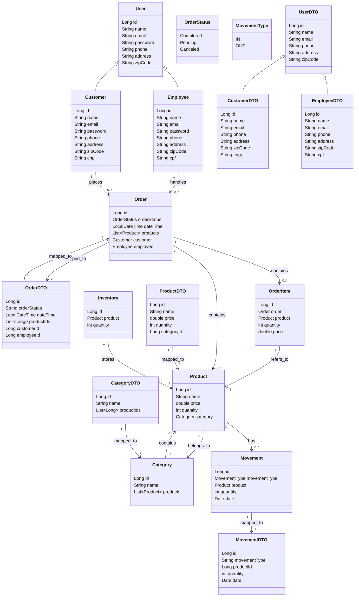

# Class Diagram

```mermaid
   classDiagram
    class User {
        Long id
        String name
        String email
        String password
        String phone
        String address
        String zipCode
    }
    
    class Employee {
        Long id
        String name
        String email
        String password
        String phone
        String address
        String zipCode
        String cpf
    }

    class Customer {
        Long id
        String name
        String email
        String password
        String phone
        String address
        String zipCode
        String cnpj
    }

    class Order {
        Long id
        OrderStatus orderStatus
        LocalDateTime dateTime
        List~Product~ products
        Customer customer
        Employee employee
    }

    class OrderItem {
        Long id
        Order order
        Product product
        int quantity
        double price
    }

    class OrderStatus {
        Completed
        Pending
        Canceled
    }


    class Inventory {
        Long id
        Product product
        int quantity
    }

    class ProductDTO {
        Long id
        String name
        double price
        int quantity
        Long categoryId
    }

    class CategoryDTO {
        Long id
        String name
        List~Long~ productIds
    }

    class OrderDTO {
        Long id
        String orderStatus
        LocalDateTime dateTime
        List~Long~ productIds
        Long customerId
        Long employeeId
    }

    class Product {
        Long id
        String name
        double price
        int quantity
        Category category
    }

    class Category {
        Long id
        String name
        List~Product~ products
    }

    class Movement {
        Long id
        MovementType movementType
        Product product
        int quantity
        Date date
    }

    class MovementDTO {
        Long id
        String movementType
        Long productId
        int quantity
        Date date
    }

    class MovementType {
        IN
        OUT
    }

    class UserDTO {
        Long id
        String name
        String email
        String phone
        String address
        String zipCode
    }

    class CustomerDTO {
        Long id
        String name
        String email
        String phone
        String address
        String zipCode
        String cnpj
    }

    class EmployeeDTO {
        Long id
        String name
        String email
        String phone
        String address
        String zipCode
        String cpf
    }

    User <|-- Employee
    User <|-- Customer
    UserDTO <|-- EmployeeDTO
    UserDTO <|-- CustomerDTO

    Customer "1" --> "0..*" Order : places
    Employee "1" --> "0..*" Order : handles
    Order "1" --> "0..*" OrderItem : contains
    OrderItem "1" --> "1" Product : refers_to
    Order "1" --> "0..*" Product : contains
    Inventory "1" --> "1" Product : stores
    Product "1" --> "0..*" Movement : has
    Product "1" --> "1" Category : belongs_to
    Category "1" --> "0..*" Product : contains
    Movement "1" --> "1" MovementDTO : mapped_to
    Order "1" --> "1" OrderDTO : mapped_to
    ProductDTO "1" --> "1" Product : mapped_to
    CategoryDTO "1" --> "1" Category : mapped_to
    OrderDTO "1" --> "1" Order : mapped_to
```
